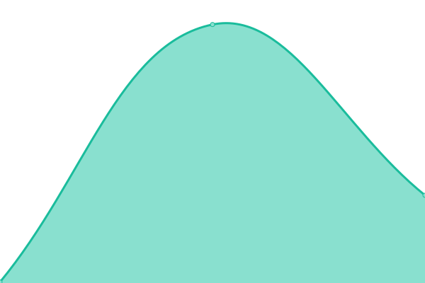

# [📈 Live Status](https://zzc-tongji.github.io/upptime): <!--live status--> **🟧 Partial outage**

This repository contains the open-source uptime monitor and status page for [Zhicheng Zhang](https://zzc-tongji.github.io/upptime), powered by [Upptime](https://github.com/upptime/upptime).

With [Upptime](https://upptime.js.org), you can get your own unlimited and free uptime monitor and status page, powered entirely by a GitHub repository. We use [Issues](https://github.com/zzc-tongji/upptime/issues) as incident reports, [Actions](https://github.com/zzc-tongji/upptime/actions) as uptime monitors, and [Pages](https://zzc-tongji.github.io/upptime) for the status page.

<!--start: status pages-->
<!-- This summary is generated by Upptime (https://github.com/upptime/upptime) -->
<!-- Do not edit this manually, your changes will be overwritten -->
<!-- prettier-ignore -->
| URL | Status | History | Response Time | Uptime |
| --- | ------ | ------- | ------------- | ------ |
|  S3 文件管理 | 🟩 Up | [s3.yml](https://github.com/zzc-tongji/upptime/commits/HEAD/history/s3.yml) | 

 184ms
     
 | 

<a href="https://zzc-tongji.github.io/upptime/history/s3">100.00%</a>
    

|  S3 文件服务 | 🟩 Up | [s3.yml](https://github.com/zzc-tongji/upptime/commits/HEAD/history/s3.yml) | 

 184ms
     
 | 

<a href="https://zzc-tongji.github.io/upptime/history/s3">100.00%</a>
    

|  GitHub 代理服务 | 🟥 Down | [git-hub.yml](https://github.com/zzc-tongji/upptime/commits/HEAD/history/git-hub.yml) | 

 355ms
     
 | 

<a href="https://zzc-tongji.github.io/upptime/history/git-hub">99.65%</a>
    

|  OSS 文件管理 | 🟩 Up | [oss.yml](https://github.com/zzc-tongji/upptime/commits/HEAD/history/oss.yml) | 

 836ms
     
 | 

<a href="https://zzc-tongji.github.io/upptime/history/oss">100.00%</a>
    

|  OSS 文件服务 | 🟩 Up | [oss.yml](https://github.com/zzc-tongji/upptime/commits/HEAD/history/oss.yml) | 

 836ms
     
 | 

<a href="https://zzc-tongji.github.io/upptime/history/oss">100.00%</a>
    

|  飞书服务 | 🟩 Up | [.yml](https://github.com/zzc-tongji/upptime/commits/HEAD/history/.yml) | 

 713ms
     
 | 

<a href="https://zzc-tongji.github.io/upptime/history/">99.65%</a>
    

|  FRP 内网穿透服务 | 🟩 Up | [frp.yml](https://github.com/zzc-tongji/upptime/commits/HEAD/history/frp.yml) | 

 151ms
     
 | 

<a href="https://zzc-tongji.github.io/upptime/history/frp">100.00%</a>
    

|  MIX2 @ 公共网络 | 🟩 Up | [mix-2.yml](https://github.com/zzc-tongji/upptime/commits/HEAD/history/mix-2.yml) | 

 160ms
     
 | 

<a href="https://zzc-tongji.github.io/upptime/history/mix-2">100.00%</a>
    

|  N40 @ 公共网络 | 🟩 Up | [n40.yml](https://github.com/zzc-tongji/upptime/commits/HEAD/history/n40.yml) | 

 247ms
     
 | 

<a href="https://zzc-tongji.github.io/upptime/history/n40">100.00%</a>
    

|  UM300 @ 公共网络 | 🟩 Up | [um-300.yml](https://github.com/zzc-tongji/upptime/commits/HEAD/history/um-300.yml) | 

 144ms
     
 | 

<a href="https://zzc-tongji.github.io/upptime/history/um-300">100.00%</a>
    

|  MIX2 @ 家庭网络 | 🟩 Up | [mix-2.yml](https://github.com/zzc-tongji/upptime/commits/HEAD/history/mix-2.yml) | 

 160ms
     
 | 

<a href="https://zzc-tongji.github.io/upptime/history/mix-2">100.00%</a>
    

|  N40 @ 家庭网络 | 🟩 Up | [n40.yml](https://github.com/zzc-tongji/upptime/commits/HEAD/history/n40.yml) | 

 247ms
     
 | 

<a href="https://zzc-tongji.github.io/upptime/history/n40">100.00%</a>
    

|  UM300 @ 家庭网络 | 🟩 Up | [um-300.yml](https://github.com/zzc-tongji/upptime/commits/HEAD/history/um-300.yml) | 

 144ms
     
 | 

<a href="https://zzc-tongji.github.io/upptime/history/um-300">100.00%</a>
    

<!--end: status pages-->

[**Visit our status website →**](https://zzc-tongji.github.io/upptime)

## 📄 License

- Powered by: [Upptime](https://github.com/upptime/upptime)
- Code: [MIT](./LICENSE) © [Anand Chowdhary](https://anandchowdhary.com), supported by [Pabio](https://pabio.com)
- Data in the `./history` directory: [Open Database License](https://opendatacommons.org/licenses/odbl/1-0/)
