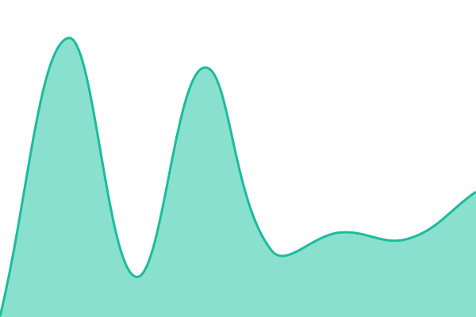
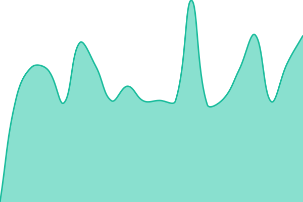
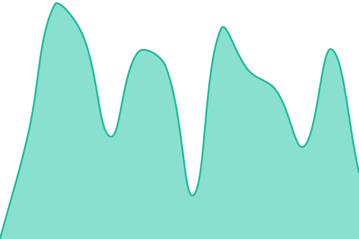

# [📈 Live Status](https://zzc-tongji.github.io/upptime): <!--live status--> **🟧 Partial outage**

This repository contains the open-source uptime monitor and status page for [Zhicheng Zhang](https://zzc-tongji.github.io/upptime), powered by [Upptime](https://github.com/upptime/upptime).

With [Upptime](https://upptime.js.org), you can get your own unlimited and free uptime monitor and status page, powered entirely by a GitHub repository. We use [Issues](https://github.com/zzc-tongji/upptime/issues) as incident reports, [Actions](https://github.com/zzc-tongji/upptime/actions) as uptime monitors, and [Pages](https://zzc-tongji.github.io/upptime) for the status page.

<!--start: status pages-->
<!-- This summary is generated by Upptime (https://github.com/upptime/upptime) -->
<!-- Do not edit this manually, your changes will be overwritten -->
<!-- prettier-ignore -->
| URL | Status | History | Response Time | Uptime |
| --- | ------ | ------- | ------------- | ------ |
|  S3 File Service | 🟩 Up | [s3-file-service.yml](https://github.com/zzc-tongji/upptime/commits/HEAD/history/s3-file-service.yml) | 

 146ms
     
 | 

<a href="https://zzc-tongji.github.io/history/s3-file-service">100.00%</a>
    

|  GitHub Proxy Service | 🟩 Up | [git-hub-proxy-service.yml](https://github.com/zzc-tongji/upptime/commits/HEAD/history/git-hub-proxy-service.yml) | 

 301ms
     
 | 

<a href="https://zzc-tongji.github.io/history/git-hub-proxy-service">100.00%</a>
    

|  OSS File Service | 🟩 Up | [oss-file-service.yml](https://github.com/zzc-tongji/upptime/commits/HEAD/history/oss-file-service.yml) | 

 2297ms
     
 | 

<a href="https://zzc-tongji.github.io/history/oss-file-service">100.00%</a>
    

|  Feishu Service | 🟥 Down | [feishu-service.yml](https://github.com/zzc-tongji/upptime/commits/HEAD/history/feishu-service.yml) | 

 2551ms
     
 | 

<a href="https://zzc-tongji.github.io/history/feishu-service">89.09%</a>
    

|  qBittorrent Service | 🟩 Up | [q-bittorrent-service.yml](https://github.com/zzc-tongji/upptime/commits/HEAD/history/q-bittorrent-service.yml) | 

 1091ms
     
 | 

<a href="https://zzc-tongji.github.io/history/q-bittorrent-service">100.00%</a>
    

|  MoviePilot Service | 🟥 Down | [movie-pilot-service.yml](https://github.com/zzc-tongji/upptime/commits/HEAD/history/movie-pilot-service.yml) | 

 2036ms
     
 | 

<a href="https://zzc-tongji.github.io/history/movie-pilot-service">89.11%</a>
    

|  PicHome Service | 🟥 Down | [pic-home-service.yml](https://github.com/zzc-tongji/upptime/commits/HEAD/history/pic-home-service.yml) | 

 2534ms
     
 | 

<a href="https://zzc-tongji.github.io/history/pic-home-service">89.12%</a>
    

|  FRP Service | 🟩 Up | [frp-service.yml](https://github.com/zzc-tongji/upptime/commits/HEAD/history/frp-service.yml) | 

 227ms
     
 | 

<a href="https://zzc-tongji.github.io/history/frp-service">100.00%</a>
    

|  MIX2 at FRP | 🟥 Down | [mix-2-at-frp.yml](https://github.com/zzc-tongji/upptime/commits/HEAD/history/mix-2-at-frp.yml) | 

 197ms
     
 | 

<a href="https://zzc-tongji.github.io/history/mix-2-at-frp">25.08%</a>
    

|  N40 at FRP | 🟥 Down | [n40-at-frp.yml](https://github.com/zzc-tongji/upptime/commits/HEAD/history/n40-at-frp.yml) | 

 221ms
     
 | 

<a href="https://zzc-tongji.github.io/history/n40-at-frp">98.59%</a>
    

|  UM300 at FRP | 🟥 Down | [um-300-at-frp.yml](https://github.com/zzc-tongji/upptime/commits/HEAD/history/um-300-at-frp.yml) | 

 222ms
     
 | 

<a href="https://zzc-tongji.github.io/history/um-300-at-frp">98.60%</a>
    

|  OpenVPN at Home | 🟩 Up | [open-vpn-at-home.yml](https://github.com/zzc-tongji/upptime/commits/HEAD/history/open-vpn-at-home.yml) | 

 231ms
     
 | 

<a href="https://zzc-tongji.github.io/history/open-vpn-at-home">100.00%</a>
    

|  N40 at Home | 🟩 Up | [n40-at-home.yml](https://github.com/zzc-tongji/upptime/commits/HEAD/history/n40-at-home.yml) | 

 232ms
     
 | 

<a href="https://zzc-tongji.github.io/history/n40-at-home">100.00%</a>
    

|  UM300 at Home | 🟩 Up | [um-300-at-home.yml](https://github.com/zzc-tongji/upptime/commits/HEAD/history/um-300-at-home.yml) | 

 228ms
     
 | 

<a href="https://zzc-tongji.github.io/history/um-300-at-home">99.19%</a>
    

<!--end: status pages-->

[**Visit our status website →**](https://zzc-tongji.github.io/upptime)

## 📄 License

- Powered by: [Upptime](https://github.com/upptime/upptime)
- Code: [MIT](./LICENSE) © [Anand Chowdhary](https://anandchowdhary.com), supported by [Pabio](https://pabio.com)
- Data in the `./history` directory: [Open Database License](https://opendatacommons.org/licenses/odbl/1-0/)
